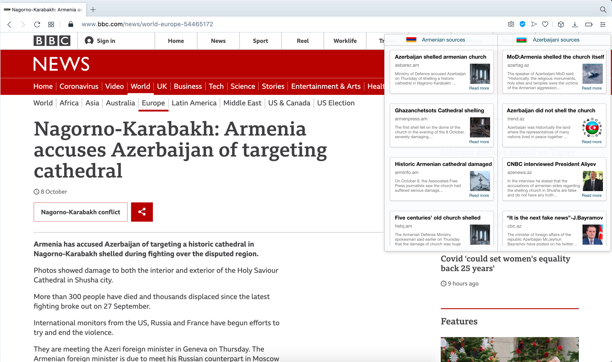

# GlobalDefTechHack_NoBias

## Idea:
The information war is always a consistent part of any military conflict. As we also experienced during the events of the Karabakh War II,  details of the war are conveyed only from one perspective and not objectively; for example, by international networks, such as France24, Aljazeera, The Guardian, etc. In particular, biased news is the major source of misinformation and propaganda. According to American psychologist Silvio Bronzo's book, “How propaganda works”, one of the most effective ways to prevent propaganda is to provide news from all conflicting sides. Inspired by that, we came up with an idea to create a browser extension called “NoBias”, which performs the following:

- Semantic analysis of a current news article on any international website (The Guardian, BBC, etc.) Here we use Natural Language Processing (NLTK Python lib.)
- Compares the current news article to all the news in the database. Considering II Karabakh War, in particular, we extracted 3000+ news from the top 7 Azerbaijani and Armenian portals. So the data is available and stored in the database. We perform K-Means Clustering (Machine Learning) of news articles in order to cluster them by topics and then, we run a relevance test between a current news article and all the news in the database (optimized for computational efficiency by using RUST programming language). The goal here is to show only those news relevant to the one you're reading on the international website (as you can also see from the image below).
- Something similar to the image below is the final appearance of our extension.

Only this way, we will be able to eliminate any bias and stop propaganda. For this hackathon, our target audience is international newsreaders. Our goal is to bring justice to the world via our product.

## Business Plan (a rough version, the full business plan with precise details will be demonstrated during the final pitch)

- Scalability: NoBias can be scaled and globalized to consider any type of propaganda, not only military conflict-based.
- Demographics: besides international users, customers will be private entities ( companies interested in propaganda against their brands) and governments (interested in tracking biased news directed towards anti-government propaganda). 
- Subscription-based model: Our final product for this hackathon will act as a Free Version. The ultimate product will be a Pro Version and include the following advancements: more advanced semantic analysis tools, more conflicting sides, more languages (Russian, French, etc.) 

## Workflow 
The entire workflow is described below. 

### Step 1: Natural Language Processing
We begin by parsing info from the current news article (ex: "Nagorno-Karabakh truce in jeopardy as accusations of violations fly" from The Guardian). We use NEWSPAPER Python library to extract the content, publication date, title, images and videos. In advance, on our database we have 6000+ news articles extracted from top 14 Azerbaijani and Armenian news portals. However, this data is not simply stored there; we apply K-means Clusterising (a Machine Learning model) to cluster news into categories. Then the keywords list for each category is defined and current news article is compared to those keywords through a rigorous RELEVANCE FUNCTION that we have written. The working principle of this function is based on assigning weights to nouns (e.g. missile, civilians, bombs), verbs (e.g. attack, liberate) and proper names (e.g. Hikmat Hajiyev, Ilham Aliyev) and defining final metrics for each article. At the stage of defining what news are relevant, these metrics are utilized. Please see respective codes for more details. Once all compared, top 5 relevant news from both conflicting sides are selected and displayed on the front-end of our extension. 

### Step 2: Optimization with RUST
Fast computation is the key in our product. Obviously, we can't ask a user to wait for too long while the algorithm finds relevant news. In order to process everything in at most 3 sec, we translate the entire code into RUST programming language. 

### Back-end

### Front-end
